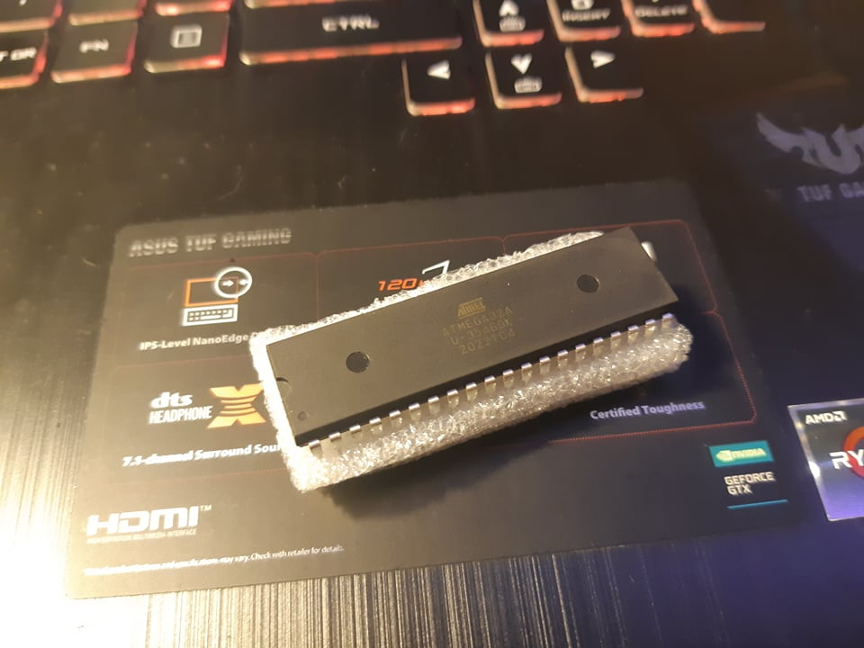
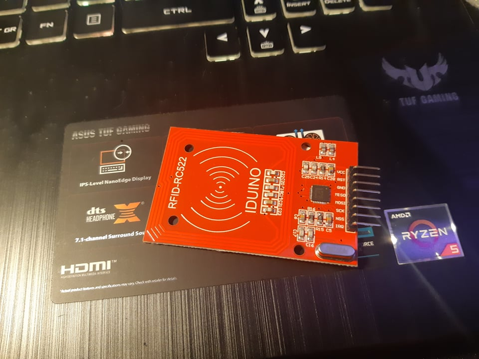
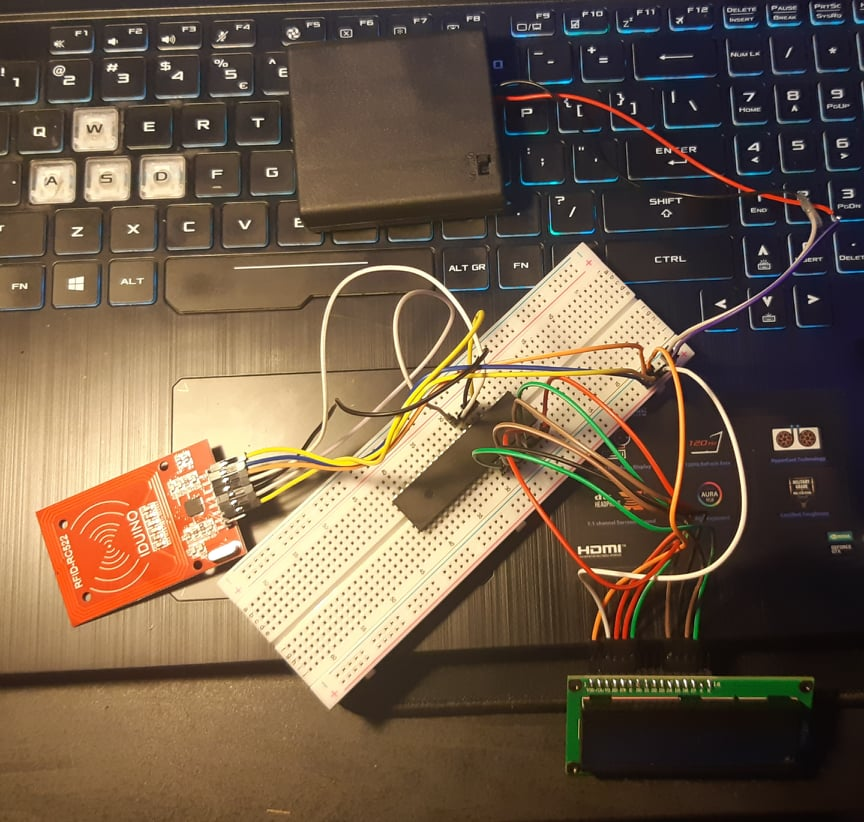

# Jakub Malik
# Projekt na laboratorium Techniki mikroprocesorowej

# Temat projektu
W ramach tego projektu zamierzam zbudować i zaprogramować system bezpieczeństwa oparty na tokenach RFID. Układ będzie decydował o udzieleniu dostępu (otwarciu np. drzwi) na podstawie zastosowanej przez użytkownika karcie bądź breloku RFID. Konstrukcja zostanie wykonana w oparciu o mikrokontroler ATMega 32A-PU.

# Lista elementów
**Hardware:** ATMega 32A-PU, programator AVR, wyświetlacz LCD 16x2, moduł RFID RC522, karta oraz brelok RFID, zasilanie 5V, przewody oraz płytka prototypowa. \
**Software:** Visual Studio Code

# Dlaczego ATMega32A-PU
Mój wybór padł na ten konkretny mikrokontroler, ponieważ w opinii wielu, ukontrolery produkowane przez firmę Atmel są świetnym rozwiązaniem na początek przygody z programowaniem. W internecie znajdziemy olbrzymią liczbę opracowań różnych problemów i rozwiązań na jakie możemy się natknąć w trakcie pracy z ukontrolerem.



# Dlaczego moduł RFID RC522
Głównym powodem wyboru tego konkretnego modułu była moja styczność z nim w trakcie realizacji poprzednich projektów. Układ jest stosunkowo łatwy w obsłudze, tani oraz posiada na start, w zestawie, kartę oraz brelok RFID. Płytka umożliwia odczyt i zapis danych z urządzeń RFID na częstotliwości 13,56 MHz, oparty jest o popularny układ RC522, posiada wbudowaną antenę, a zasilany jest napięciem 3,3V.



# Wymagane połaczenia
## ATMega32A ⟶ RFID RC522
- `PB4` ⟶ `SDA/SS`
- `PB5` ⟶ `MOSI`
- `PB6` ⟶ `MISO`
- `PB7` ⟶ `SCK`
\
Wyprowadzenie `IRQ` modułu `RFID RC522` nie jest połączone, natomiast `GND` ⟶ `GND`, `RST` ⟶ `+3.3V`, `3.3V` ⟶ `+3.3V`

## ATMega32A ⟶ LCD
- `PA0` ⟶ `RS`
- `PA1` ⟶ `RW`
- `PA2` ⟶ `E`
- `PA4` ⟶ `D4`
- `PA5` ⟶ `D5`
- `PA6` ⟶ `D6`
- `PA7` ⟶ `D7`
\
Pin `1` wyświetlacza połączono z `GND`, natomiast `3` z `+5V`. \
Finalnie połączony układ wygląda następująco:


## Zawartość pliku main.c

```cpp
uint8_t SelfTestBuffer[64];

int main(void)
{
  uint8_t byte;
  uint8_t str[MAX_LEN];
  _delay_ms(50);
  LCD_init();
  LCD_gotoxy(1, 1);
  LCD_write_string("Projekt TM");
  LCD_gotoxy(2, 9);
  LCD_write_string("Jakub Malik");

  spi_init();
  _delay_ms(1500);
  LCD_clear();
  _delay_ms(1500);
  LCD_gotoxy(1, 1);
  LCD_write_string("SPI Init done");
  _delay_ms(1500);

  mfrc522_init();
  byte = 0x55;
  _delay_ms(1500);
  byte = mfrc522_read(VersionReg);
  _delay_ms(1500);

  if (byte == 0x92)
  {
    LCD_clear();
    LCD_gotoxy(1, 1);
    LCD_write_string("RC522v2");
    LCD_gotoxy(2, 9);
    LCD_write_string("Wykryto");    
  }else if (byte == 0x91 || byte == 0x90)
  {
    LCD_clear();
    LCD_gotoxy(1, 1);
    LCD_write_string("RC522v1");
    LCD_gotoxy(2, 9);
    LCD_write_string("Wykryto");
  }else
  {
    LCD_clear();
    LCD_gotoxy(1, 1);
    LCD_write_string("Nie wykryto");
  }

  byte = mfrc522_read(ComIEnReg);
  mfrc522_write(ComIEnReg, byte|0x20);
  byte = mfrc522_read(DivIEnReg);
  mfrc522_write(DivIEnReg, byte|0x80);

  _delay_ms(1500);
  LCD_clear();
  
    
  while (1)
  {
    byte = mfrc522_request(PICC_REQALL, str);
    _delay_ms(1000);
  }
}
```
Powyższy kod sprawdza i weryfikuje obecność karty RFID oraz wyświetla, czy użyta została karta A czy B. \
Aby obsługa modułu `RFID RC522` była możliwa, wymagane było napisanie odpowiedniej biblioteki odpowiedzialnej za uruchomienie i komunikację modułu z ukontrolerem.

## Zawartość pliku rfid522.c
```cpp
void mfrc522_init()
{
	uint8_t byte;
	mfrc522_reset();
	
	mfrc522_write(TModeReg, 0x8D);
    mfrc522_write(TPrescalerReg, 0x3E);
    mfrc522_write(TReloadReg_1, 30);   
    mfrc522_write(TReloadReg_2, 0);	
	mfrc522_write(TxASKReg, 0x40);	
	mfrc522_write(ModeReg, 0x3D);
	
	byte = mfrc522_read(TxControlReg);
	if(!(byte&0x03))
	{
		mfrc522_write(TxControlReg,byte|0x03);
	}
}

void mfrc522_write(uint8_t reg, uint8_t data)
{
	ENABLE_CHIP();
	spi_transmit((reg<<1)&0x7E);
	spi_transmit(data);
	DISABLE_CHIP();
}

uint8_t mfrc522_read(uint8_t reg)
{
	uint8_t data;	
	ENABLE_CHIP();
	spi_transmit(((reg<<1)&0x7E)|0x80);
	data = spi_transmit(0x00);
	DISABLE_CHIP();
	return data;
}

void mfrc522_reset()
{
	mfrc522_write(CommandReg,SoftReset_CMD);
}

uint8_t	mfrc522_request(uint8_t req_mode, uint8_t * tag_type)
{
	uint8_t  status;  
	uint32_t backBits;//Odebrane bity danych

	mfrc522_write(BitFramingReg, 0x07);//TxLastBists = BitFramingReg[2..0]
	
	tag_type[0] = req_mode;
	status = mfrc522_to_card(Transceive_CMD, tag_type, 1, tag_type, &backBits);

	if ((status != CARD_FOUND) || (backBits != 0x10))
	{    
		status = ERROR;
	}
   
	return status;
}

uint8_t mfrc522_to_card(uint8_t cmd, uint8_t *send_data, uint8_t send_data_len, uint8_t *back_data, uint32_t *back_data_len)
{
	uint8_t status = ERROR;
    uint8_t irqEn = 0x00;
    uint8_t waitIRq = 0x00;
    uint8_t lastBits;
    uint8_t n;
    uint8_t	tmp;
    uint32_t i;

    switch (cmd)
    {
        case MFAuthent_CMD:		//Zakończenie weryfikacji karty
		{
			irqEn = 0x12;
			waitIRq = 0x10;
			break;
		}
		case Transceive_CMD:	//Przesyła dane FIFO
		{
			irqEn = 0x77;
			waitIRq = 0x30;
			break;
		}
		default:
			break;
    }
   
    n=mfrc522_read(ComIrqReg);
    mfrc522_write(ComIrqReg,n&(~0x80));//Czyści wszystkie bity przerwań
    n=mfrc522_read(FIFOLevelReg);
    mfrc522_write(FIFOLevelReg,n|0x80);
    
	mfrc522_write(CommandReg, Idle_CMD);	//Anuluj bieżące polecenie

	//Writing data to the FIFO
    for (i=0; i<send_data_len; i++)
    {   
		mfrc522_write(FIFODataReg, send_data[i]);    
	}

	//Execute the cmd
	mfrc522_write(CommandReg, cmd);
    if (cmd == Transceive_CMD)
    {    
		n=mfrc522_read(BitFramingReg);
		mfrc522_write(BitFramingReg,n|0x80);  
	}   
    
	//Czeka na odebranie danych
	i = 2000;	//Zgodnie z regulacją częstotliwości zegara, maksymalny czas oczekiwania karty użytkownika M1 to 25ms 
    do 
    {
		     n = mfrc522_read(ComIrqReg);
        i--;
    }
    while ((i!=0) && !(n&0x01) && !(n&waitIRq));

	tmp=mfrc522_read(BitFramingReg);
	mfrc522_write(BitFramingReg,tmp&(~0x80));
	
    if (i != 0)
    {    
        if(!(mfrc522_read(ErrorReg) & 0x1B))	//BufferOvfl Collerr CRCErr ProtecolErr
        {
            status = CARD_FOUND;
            if (n & irqEn & 0x01)
            {   
				status = CARD_NOT_FOUND;			  
			}

            if (cmd == Transceive_CMD)
            {
               	n = mfrc522_read(FIFOLevelReg);
              	lastBits = mfrc522_read(ControlReg) & 0x07;
                if (lastBits)
                {   
					*back_data_len = (n-1)*8 + lastBits;   
				}
                else
                {   
					*back_data_len = n*8;   
				}

                if (n == 0)
                {   
					n = 1;    
				}
                if (n > MAX_LEN)
                {   
					n = MAX_LEN;   
				}
				
				//Odczyt odebranych danych w FIFO
                for (i=0; i<n; i++)
                {   
					back_data[i] = mfrc522_read(FIFODataReg);    
				}
            }
        }
        else
        {   
			status = ERROR;  
		}
        
    }
	
    SetBitMask(ControlReg,0x80);           //zatrzymanie timera
     

    return status;
}
```
## Notatka od autora
Należy zwrócić szczególną uwagę przy podłączniu ukontrolera do programatora, ponieważ nieuważne wykonanie połączeń niechybnie doprowadzi do spalenia układu. Jest to związane z zagadnieniem minimalnej liczby połączeń ukontrolera o czym autor zapomniał, w wyniku czego układ zrobił puf.